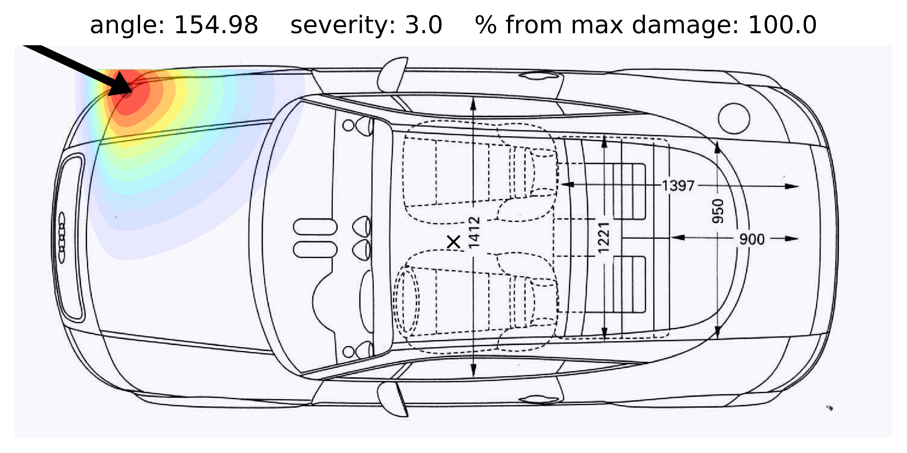
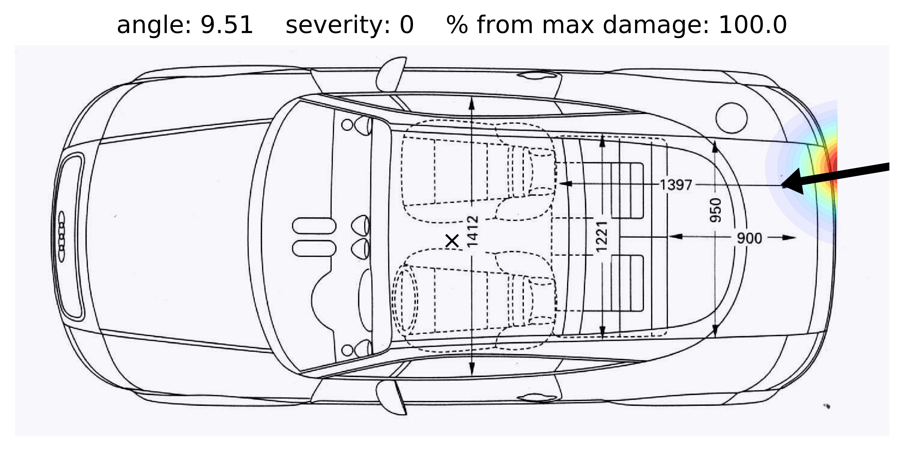

# CRSH SIMULATION

This is the solution of the Team "StartGallen" of the challenge from
[autoSense](htttp://autosense.ch) in
[STARTHACK2019](http://starthack.ch) in St. Gallen.

We implemented:
1. a calibration procedure for the coordinate transformation
2. detection of impact angle
3. evaluation of time of Maximum Force applied to the car from start of the data tracking
4. estimation impact of the car based on the time and severity of the car accident
5. visualization of impact damage

This application is currently deployed on Google Cloud Platform
instance with IP address 35.198.180.180 with flask and gunicorn. We
also provide Dockerfile for the easier deployment.

API examples:

    curl -H "Content-Type: application/json" -X POST -d @1.json  http://35.198.180.180:80/api/v1/getCrashInfo
    curl -H "Content-Type: application/json" -X POST -d @1.json  http://35.198.180.180:80/api/v1/getCrashImage?timeOffsetMS=50000 --output xxx.jpg

here 1.json is the file in the format of the data provided initially,
`timeOffsetMS` is a parameter in millisecons since the start of the
time in data.

The first call returns data in JSON format. Example:
`{"impactAngle":154.98051407054078,"offsetMaximumForce":36143.61990907687}`

The second call returns image `xxx.jpg` which is visualization of how
large are the damage of the car at the moment of time
`timeOffsetMS`. The peak of damages correspond to the
`offsetMaximumForce`. Damage starts 1 second before the
`offsetMaximumForce` and continues half of the second after
`offsetMaximumForce`. If `timeOffsetMS < offsetMaximumForce` - 1s,
then image of the car without damages will be returned. If
`timeOffsetMS > offsetMaximumForce -0.5s` then image of maximum damage
will be returned.

Examples of damages visualizations:

